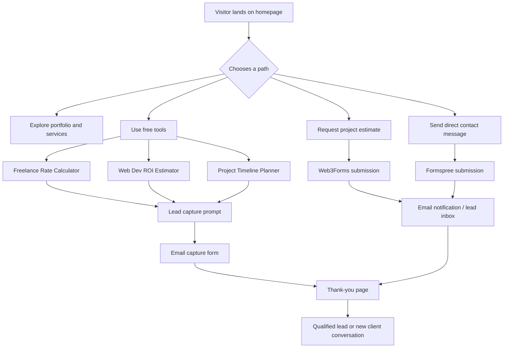
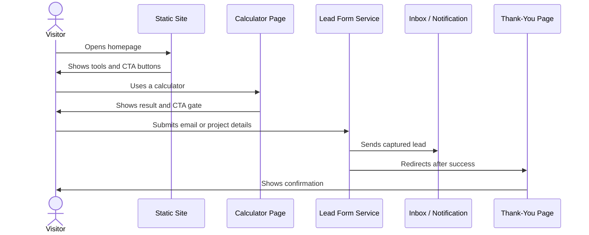

<p align="center">
  
</p>

<p align="center">
  <a href="https://github.com/NileGazer00/NileGazer00.github.io/blob/main/LICENSE">
    
  </a>
  <a href="https://github.com/NileGazer00/NileGazer00.github.io">
    
  </a>
  <a href="https://github.com/NileGazer00/NileGazer00.github.io/actions">
    
  </a>
  <a href="https://github.com/NileGazer00/NileGazer00.github.io/stargazers">
    
  </a>
</p>

<p align="center">
  <strong>High-performance static portfolio website built to attract premium clients and capture qualified leads</strong><br />
  React • Next.js • TypeScript • Tailwind CSS • Framer Motion • HTML/CSS/JS
</p>

<p align="center">
  <a href="#about-this-project">About</a> •
  <a href="#how-it-works">How It Works</a> •
  <a href="#site-structure">Structure</a> •
  <a href="#lead-generation-flow">Lead Flow</a> •
  <a href="#free-tools">Tools</a> •
  <a href="#getting-started">Getting Started</a> •
  <a href="#deployment">Deployment</a>
</p>

---

## About This Project

**NileGazer00.github.io** is a conversion-focused static website designed to showcase Nile Gazer’s work, generate qualified leads, and provide free tools for developers and business owners. The site combines a portfolio-style homepage with gated utility tools and direct contact paths, making it both a personal brand site and a lead-generation engine.

The project is built for speed, simplicity, and reach. It uses pure HTML, CSS, and JavaScript, so it can be deployed easily on GitHub Pages without a backend.

## What It Includes

- A polished homepage with strong positioning and clear calls to action.
- A free project estimate flow for lead capture.
- A contact page for direct inquiries.
- Three interactive tools that help visitors while encouraging conversion.
- A thank-you page to complete the funnel.
- Responsive design for mobile, tablet, and desktop.

## How It Works



## How The Site Works

The homepage introduces the developer brand and gives visitors a few clear choices. They can review the portfolio message, open one of the free tools, request a project estimate, or send a contact message.

The tools are designed as lead magnets. Each calculator gives useful output first, then encourages the user to submit an email or continue to a contact flow. That means the site delivers value before asking for conversion, which usually performs better than a simple contact form alone.

The lead capture pages use third-party form handling services, so there is no custom backend server to maintain. Once a visitor submits a form, the data is delivered directly to the chosen inbox or service endpoint, and the user is redirected to a thank-you page.

## Site Structure

```text
NileGazer00.github.io/
├── index.html
├── lead-capture.html
├── contact.html
├── thanks.html
├── styles.css
├── script.js
└── tools/
    ├── freelance-rate-calc.html
    ├── roi-calculator.html
    └── timeline-planner.html
```

### File roles

- `index.html` is the homepage and main entry point.
- `lead-capture.html` handles project estimate submissions.
- `contact.html` handles general contact messages.
- `thanks.html` confirms successful submission.
- `styles.css` contains the global responsive styling.
- `script.js` manages small interactions like smooth scrolling and logging.
- `tools/` contains the gated calculator pages.

## Lead Generation Flow



## Free Tools

### Freelance Rate Calculator
Helps visitors estimate a realistic hourly or project rate based on experience, cost, and profit goals. This is useful for freelancers and consultants who want to price their work properly.

### Web Dev ROI Estimator
Helps businesses estimate return on investment for a website or web app. This makes the site useful to founders and business owners who are comparing development cost against revenue potential.

### Project Timeline Planner
Helps users estimate how long a web project may take based on scope, complexity, and team size. This is valuable for planning and also helps qualify serious prospects.

## Why This Site Converts

- The site gives value immediately through tools.
- The lead capture appears after the user sees a benefit.
- The layout is simple, fast, and mobile-friendly.
- The messaging targets both developers and business owners.
- The direct estimate and contact options create multiple conversion paths.

## Getting Started

### Local preview

Open `index.html` in a browser, or use a simple local server for a better development experience.

### Edit content

Update the homepage copy, tool text, contact details, and form endpoints to match your brand and services.

### Customize forms

Update the Web3Forms and Formspree keys in the relevant HTML files, then verify that submissions are routed correctly to your email inbox.

## Deployment

This site is built for GitHub Pages and works well as a static site. Push the repository to GitHub, enable Pages in the repository settings, and the site will deploy without any backend setup.

Because the project is static, it is also easy to move to other hosting providers such as Netlify or Vercel later if needed.

## Tech Stack

- HTML
- CSS
- JavaScript
- GitHub Pages
- Web3Forms
- Formspree

## Contact

If someone wants to hire you, the site gives them two paths:
- a project estimate form for higher-intent inquiries.
- a contact form for general messages.

The homepage also links to the live tools, helping visitors engage before they reach out.

## License

Released under the MIT License.
